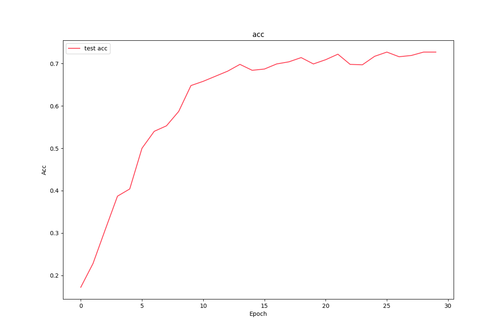

# GraphSAGE 节点分类

## 简介

GCN（Graph Convolutional Network）的出现带动了将神经网络技术用于图数据的学习任务中去，并产生了大量的方法，这类方法我们统称为图神经网络（Graph Neural Networks，GNN）。我们知道，图卷积可以从谱域和空域两个角度看待（尽管后来逐渐深入的研究表明，所谓的谱域图卷积其实就是特殊的空域图卷积而已），从空域来看，GCN 的本质就是一个迭代式地聚合邻居的过程，这个思路启发了一大类模型对于这种聚合操作的重新设计，比如比较有名的 GraphSAGE、GAT、R-GCN，这些以空域视角出发的图网络算法，通常被叫做空域图卷积。本文在本系列上一篇文章[GCN 节点分类](https://zhouchen.blog.csdn.net/article/details/109545545)的基础上，使用 Pytorch 实现 GraphSAGE 对 Cora 数据集进行节点分类。

## GraphSAGE 算法简述

GraphSAGE 其实在两个方面对 GCN 做了改动，一方面是通过**采样邻居**的策略将 GCN 由全图（full batch）的训练方式改造成以节点为中心的小批量（mini batch）的训练方式，这使得大规模图数据的分布式训练成为了可能；另一方面，GraphSAGE 对**聚合邻居**的操作进行了拓展，提出了替换 GCN 操作的新的方式。

### **采样邻居**

GCN 的训练是全图形式的，就是说一轮迭代，所有节点的样本的损失只会贡献一次梯度，无法做到深度神经网络中常用的小批量更新，从梯度更新的次数来看这是很低效的。这还不是重点，事实上，实际业务中，图的规模是巨大的，显存或者内存很难容纳下模型和整个图，因此采用小批量的训练方法是**必要的**。GraphSAGE 从聚合邻居的操作出发，对邻居进行随机采样来控制实际运算时节点$k$阶子图的数据规模，在此基础上对采样的子图进行随机组合来完成小批量训练。

GCN 中，节点在第$k+1$层的特征只与其邻居在$k$层的特征有关，这种局部性质导致节点在第$k$层的特征只与自己的$k$阶子图有关。虽然这样说只需要考虑节点的$k$阶子图就可以完成对节点高层特征的计算，但是对于一个大规模图数据而言，直接迁移此思路仍然存在一些问题：

1. 子图的节点数呈指数级增长。若图中的节点度均值为$\overline{d}$，执行$k$层 GCN，则$k$阶子图平均出现$1 + \overline{d} + \overline{d}^2 + \cdots + \overline{d}^k$，当$\overline{d}=10，k=4$的时候，就有$11111$个节点参与计算，这会导致很高的计算复杂度。
2. 真实的图数据节点往往呈现幂律分布，一些节点的度很大，这些节点成为超级节点，在很多图计算的问题中，超级节点都是比较难处理的对象。由于超级节点邻居数目庞大，子图节点数又呈指数级增长，计算代价会更高。

上述的情况下，遍历子图的时间代价、模型训练的计算和存储代价都会难以把控。因此，GraphSAGE 使用了采样邻居的操作来控制子图发散时的增长率。它的具体操作为：设每个节点在第$k$层的邻居采样倍率为$S_k$（这是一个超参数），即每个节点采样的一阶邻居不超过$S_k$，那么对于任意一个中心节点的表达计算，所设计的总节点数将在$O\left(\prod_{k=1}^{K} s_{k}\right)$这个级别。举个例子，对一个两层模型来说，如果$S_1=3$，$S_2=2$则总节点数不会超过$1+3+3\times2=10$个。这里对节点采样，GraphSAGE 选择了均匀分布，其实工程上会采用其他形式的分布。

通过采样邻居的策略，GraphSAGE 控制子图节点的规模始终维持在阶乘级别以下，这也给模型层数的增加提供了可能性。

### **聚合邻居**

GraphSAGE 研究了聚合邻居操作所需的性质，提出了几种新的聚合操作算子（aggregator），需满足如下条件：

1. 聚合操作必须对聚合节点的数量做到自适应。不管节点的邻居数量如何变化，进行聚合操作后输出的维度必须一致，为一个统一维度的向量。
2. 聚合操作对聚合节点具有排列不变性。图数据本身是一种无序对的数据结构，对于聚合操作而言，这就要求不管邻居节点的排列顺序如何，输出的结果总是给一样的。如$Agg(v_1, v_2)=Agg(v_2, v_1)$。

当然，从模型优化的角度看，这种聚合操作还必须可导。只要满足上述性质，聚合操作就能对任意输入的节点集合做到自适应。比较简单的算子有平均/加和聚合算子、LSTM 聚合算子、池化聚合算子等，这里就不展开了，详细可以参考[原论文](https://arxiv.org/pdf/1706.02216.pdf)3.3 节。

### **GraphSAGE 算法过程**

在上面两个机制的基础上，最后来看看 GraphSAGE 如何实现训练的。

输入：图$\mathcal{G}(\mathcal{V}, \mathcal{E})$；输入特征$\left\{\mathbf{x}_{v}, \forall v \in \mathcal{B}\right\}$；层数$K$；权重矩阵$\mathbf{W}^{k}, \forall k \in\{1, \ldots, K\}$；非线性函数$\sigma$；聚合操作 AGGREGATE $_{k}, \forall k \in\{1, \ldots, K\}$；邻居采样函数$\mathcal{N}_{k}: v \rightarrow 2^{\mathcal{V}}, \forall k \in\{1, \ldots, K\}$。

输出：所有节点的向量表示$\mathbf{z}_{v}$， $v \in \mathcal{B}$。

小批量训练过程如下：


上述算法的基本思路为先将小批集合$\mathcal{B}$内的中心节点聚合操作要涉及到的$k$阶子图一次性遍历出来，然后在这些节点上进行$K$次聚合操作的迭代式计算。上述图中的 1-7 行就是描述遍历操作，可以简单理解这个过程：要想得到某个中心节点第$k$层的特征，就需要采样其在第$k-1$层的邻居，然后对$k-1$层每个节点采样其第$k-2$层的邻居，以此类推，直到采样完第一层所有的邻居为止。注意，每层的采样函数可以单独设置。

上述算法图的 9-15 行是第二步，聚合操作，其核心为 11-13 行的三个公式。第 11 行的式子是调用聚合操作完成对每个节点邻居特征的整合输出，第 12 行是将聚合后的邻居特征与中心节点上一层的特征进行拼接，然后送到一个单层网络里得到中心节点的特征向量，第 13 行对节点的特征向量进行归一化。对这三行操作迭代$K$次就完成了对$\mathcal{B}$内所有中心节点特征向量的提取。

GraphSAGE 的算法过程完全没有拉普拉斯矩阵的参与，每个节点的特征学习过程仅仅只与其$k$阶邻居相关，而不需要全图对的结构西南西，这样的方法适合做归纳学习（Inductive Learning），这也就是 GraphSAGE 论文题目 Inductive Representation Learning on Large Graphs 的由来。这里我就不多阐述归纳学习和转导学习（Transductive Learning）的理论，需要知道的是，对 GraphSAGE 而言，新出现的节点数据，只需要遍历得到$k$阶子图，就可以代入模型进行预测，这种特性使得 GraphSAGE 潜力巨大。

总的来说，GraphSAEG 对空域视角下的 GCN 作了一次解构，提出几种邻居聚合算子，同时通过采样邻居，大大改进了算法的性能，关于其更详细的内容推荐阅读[原论文](https://arxiv.org/pdf/1706.02216.pdf)

## GraphSAGE 节点分类

本节使用 Pytorch 实现 GraphSAGE 对 Cora 数据集进行节点分类，通过代码进一步理解 GraphSAGE。GraphSAGE 包括邻居采样和邻居聚合两个方面。

首先来看邻居采样，通过下面的两个函数实现了一阶和多阶采样，为了高效，节点和邻居的关系维护一个表即可。

```python
import numpy as np


def sampling(src_nodes, sample_num, neighbor_table):
    """
    根据源节点一阶采样指定数量的邻居，有放回
    :param src_nodes:
    :param sample_num:
    :param neighbor_table:
    :return:
    """
    results = []
    for sid in src_nodes:
        # 从节点的邻居中进行有放回地进行采样
        neighbor_nodes = neighbor_table.getrow(sid).nonzero()
        res = np.random.choice(np.array(neighbor_nodes).flatten(), size=sample_num)
        results.append(res)
    return np.asarray(results).flatten()


def multihop_sampling(src_nodes, sample_nums, neighbor_table):
    """
    根据源节点进行多阶采样
    :param src_nodes:
    :param sample_nums:
    :param neighbor_table:
    :return:
    """
    sampling_result = [src_nodes]
    for k, hopk_num in enumerate(sample_nums):
        hopk_result = sampling(sampling_result[k], hopk_num, neighbor_table)
        sampling_result.append(hopk_result)
    return sampling_result
```

这样的阿斗的结果是节点的 ID，还需要根据 ID 查询节点的特征以进行聚合操作更新特征。

接着我们来看邻居聚合，定义一个 Pytorch module 来完成聚合过程，输入特征先是经过一个线性变换得到隐层特征，从而可以在第一个维度进行聚合操作，预定义了求和、均值、最大值等算子。

```python
class NeighborAggregator(nn.Module):
    def __init__(self, input_dim, output_dim,
                 use_bias=False, aggr_method="mean"):
        """
        聚合节点邻居
        :param input_dim: 输入特征的维度
        :param output_dim: 输出特征的维度
        :param use_bias: 是否使用偏置
        :param aggr_method: 邻居聚合算子形式
        """
        super(NeighborAggregator, self).__init__()
        self.input_dim = input_dim
        self.output_dim = output_dim
        self.use_bias = use_bias
        self.aggr_method = aggr_method
        self.weight = nn.Parameter(torch.Tensor(input_dim, output_dim))
        if self.use_bias:
            self.bias = nn.Parameter(torch.Tensor(self.output_dim))
        self.reset_parameters()

    def reset_parameters(self):
        init.kaiming_uniform_(self.weight)
        if self.use_bias:
            init.zeros_(self.bias)

    def forward(self, neighbor_feature):
        if self.aggr_method == "mean":
            aggr_neighbor = neighbor_feature.mean(dim=1)
        elif self.aggr_method == "sum":
            aggr_neighbor = neighbor_feature.sum(dim=1)
        elif self.aggr_method == "max":
            aggr_neighbor = neighbor_feature.max(dim=1)
        else:
            raise ValueError("Unknown aggr type, expected sum, max, or mean, but got {}"
                             .format(self.aggr_method))

        neighbor_hidden = torch.matmul(aggr_neighbor, self.weight)
        if self.use_bias:
            neighbor_hidden += self.bias

        return neighbor_hidden

    def extra_repr(self):
        return 'in_features={}, out_features={}, aggr_method={}'.format(
            self.input_dim, self.output_dim, self.aggr_method)
```

基于邻居聚合的结果对中心节点的特征进行更新。更新的方式是将邻居节点聚合的特征与经过线性变换的中心特征加和或者级联，再经过一个激活函数得到更新后的特征，依次我们就可以实现新的 GCN 层。继而，可以堆叠 SAGEGCN 来构建模型，实现训练。

```python
class GraphSAGE(nn.Module):
    def __init__(self, input_dim, hidden_dim,
                 num_neighbors_list):
        super(GraphSAGE, self).__init__()
        self.input_dim = input_dim
        self.hidden_dim = hidden_dim
        self.num_neighbors_list = num_neighbors_list
        self.num_layers = len(num_neighbors_list)
        self.gcn = nn.ModuleList()
        self.gcn.append(SAGEGCN(input_dim, hidden_dim[0]))
        for index in range(0, len(hidden_dim) - 2):
            self.gcn.append(SAGEGCN(hidden_dim[index], hidden_dim[index + 1]))
        self.gcn.append(SAGEGCN(hidden_dim[-2], hidden_dim[-1], activation=None))

    def forward(self, node_features_list):
        hidden = node_features_list
        for l in range(self.num_layers):
            next_hidden = []
            gcn = self.gcn[l]
            for hop in range(self.num_layers - l):
                src_node_features = hidden[hop]
                src_node_num = len(src_node_features)
                neighbor_node_features = hidden[hop + 1] \
                    .view((src_node_num, self.num_neighbors_list[hop], -1))
                h = gcn(src_node_features, neighbor_node_features)
                next_hidden.append(h)
            hidden = next_hidden
        return hidden[0]

    def extra_repr(self):
        return 'in_features={}, num_neighbors_list={}'.format(
            self.input_dim, self.num_neighbors_list
        )
```

下图是训练过程可视化的结果，可以看到，GraphSAGE以mini batch的方式训练，并在很少的轮次后获得了和GCN相当的精度。



## 补充说明

本文关于 GraphSAGE 的理论以及代码部分参考《深入浅出图神经网络》以及 GraphSAGE 论文原文。本文涉及到的代码开源于[Github](https://github.com/luanshiyinyang/GNN)，欢迎 star和fork。
